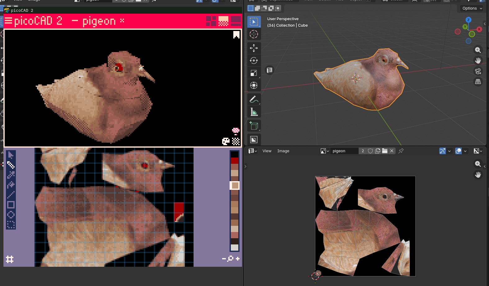
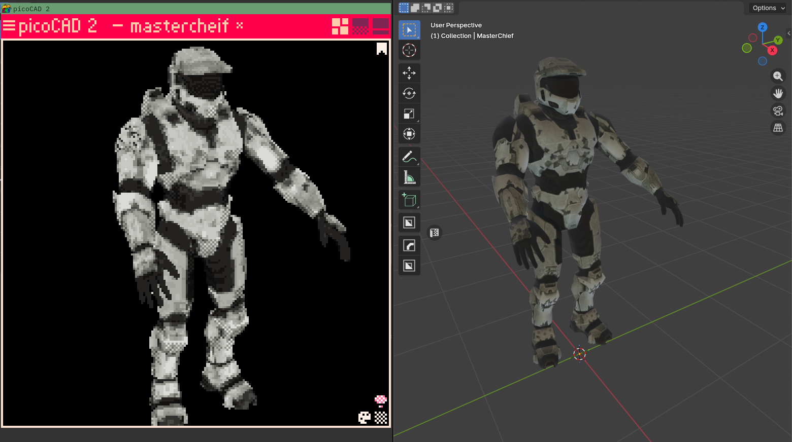

# Obj-PicoCAD2-Import



# Build

### Requirements
**OS**\
This only works on linux at the moment. I plan on releasing Windows build instructions / binaries down the line.

**libimagequant**\
libimagequant is used for converting textures into 16 colors. You can install this using a package manager on most distros. I may make this an optional feature in favor of picoCAD's png importer.\
debian or ubuntu
```Shell
apt install libimagequant
```
arch
```Shell
pacman -s libimagequant
```

**build**\
GCC and GNU Make are used to build.
```Shell
make
```

# Usage
```Shell
ObjPicoCAD2Import FILE.obj [TEXTURE.png]
# outputs to exports/output.txt
```
You pass the path to an OBJ file with an optional texture if you want to override.\
The resulting file can be opened in PicoCAD 2 with no futher modifications.\

Currently, the best approach is to use single shapes in the OBJ file.\
The code assumes there will be only one mesh and will read the entire vertex buffer.\
Support for more objects will come later.

Textures that exceed 128x128 will be resized using linear filtering.\
Subsequently textures will be posterized to 15 colors and leave room for an alpha channel.\
Posterization is done using libimagequant to quantize existing colors. I think it does an okay job but it's most likely best to handle your texture's palette and size outside of this application.

The shade palettes are just set to the base color so it's best to open the palette inside of picoCAD and select the 'robot' button to automatically assign the palette.

>[!WARNING] Please be aware that the input validation is not rigourous. Please verify your OBJ and PNG files before attempting to create saves. Additionally, outputted saves may crash picoCAD 2 as they are generated on the fly.

# Road map
In no particular order.

**Custom output path**\

**Select texture from available obj materials**\
Currently it will select the first diffuse texture from the first material if available.

**Final Transform**\
Allow for transformations to be applied to the imported model.
(e.g. scale by 0.5)

**Save editor**\
Edit an existing save by inserting a folder into the graph.

**gui implementation**\
GUI would be nice.

# LICENSE
---
## Third party licenses
**tinyobjloader-c** - MIT License - https://github.com/syoyo/tinyobjloader-c\
**cJSON** - MIT License - https://github.com/DaveGamble/cJSON\
